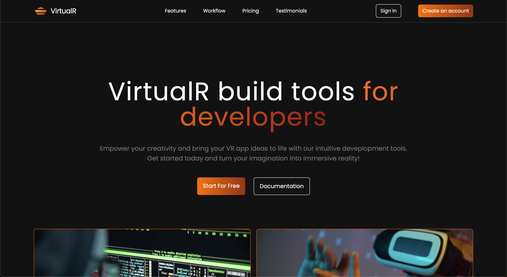
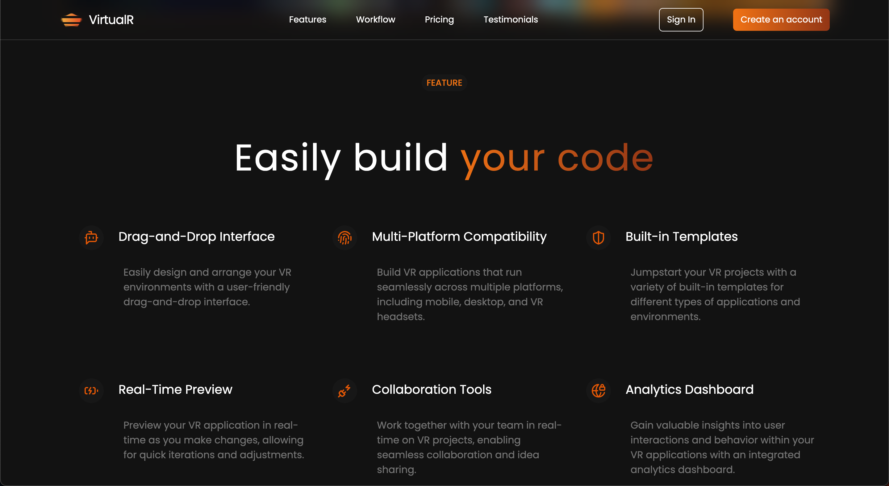
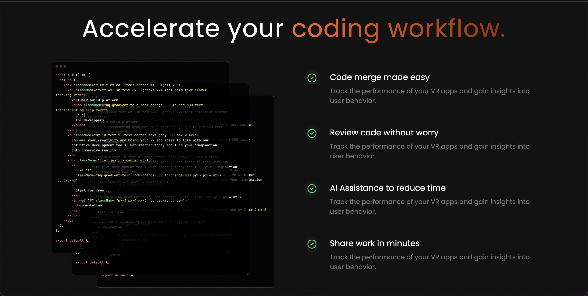
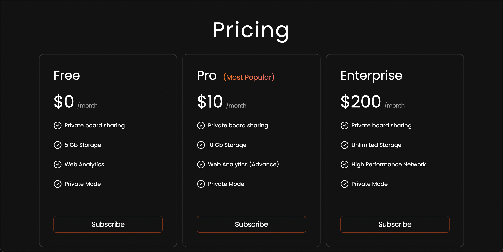
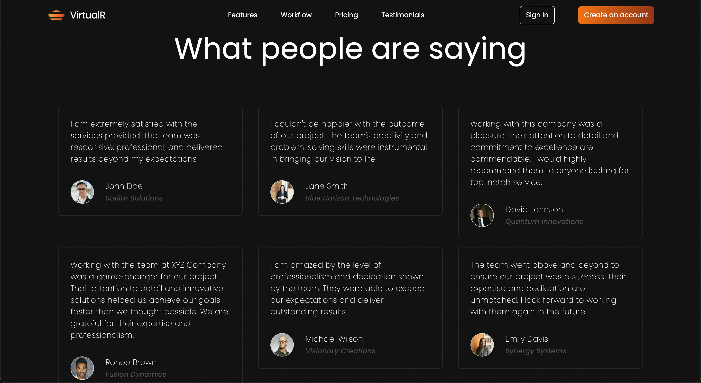
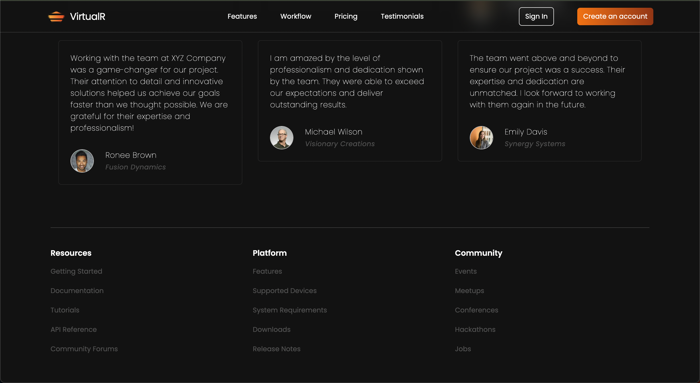

# 🕶️ VirtualR 클론 랜딩 페이지

이 프로젝트는 **React**, **TypeScript**, **Vite**, **Tailwind CSS**를 사용하여 가상현실 소프트웨어 플랫폼의 랜딩 페이지를 클론한 것입니다.

---

## 📸 미리보기

## 🚀 주요 기능

- 현대적인 반응형 디자인
- Tailwind CSS를 활용한 빠른 스타일링
- Vite를 통한 빠른 개발 환경 설정
- TypeScript로 타입 안정성 확보

---

## 🛠️ 사용 기술 스택

- **React** – 사용자 인터페이스 구축
- **TypeScript** – 정적 타입을 제공하는 JavaScript
- **Vite** – 빠른 개발 서버와 번들러
- **Tailwind CSS** – 유틸리티 기반 CSS 프레임워크

---

## 📁 프로젝트 구조

virtualr-clone/ ├── public/ ├── src/ │ ├── components/ │ ├── assets/ │ ├── App.tsx │ └── main.tsx ├── index.html ├── package.json ├── tsconfig.json └── vite.config.ts
